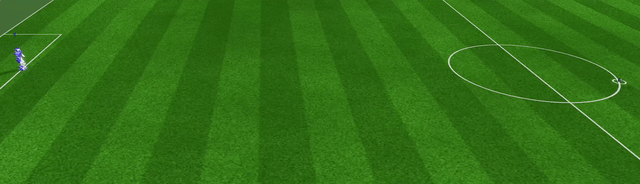
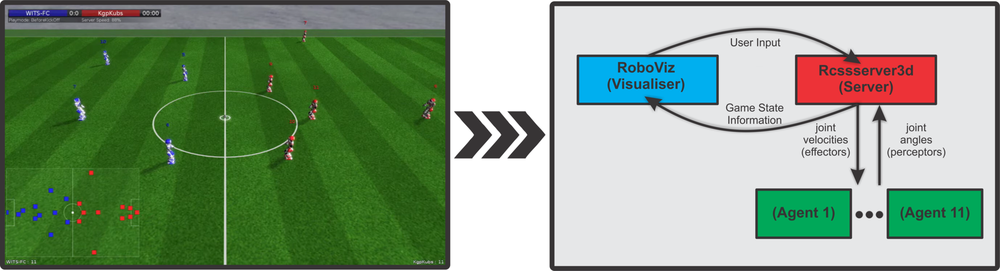
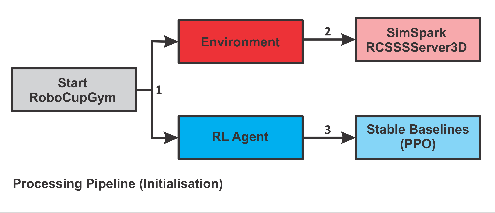
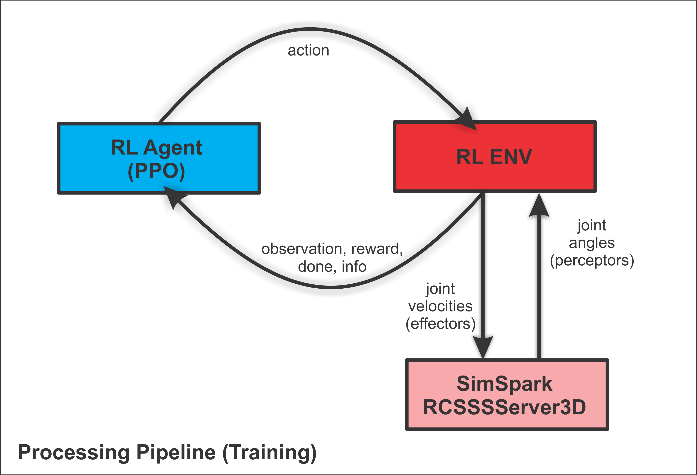

# 🏋️ 🤖 Robocup Gym ⚽
<p align="center">
<a href="#how-it-works">How it Works</a> &mdash; <a href="#tl-dr">Get Started</a> &mdash; <a href="#how-to-use-it">Training</a> &mdash; <a href="#how-to-integrate-a-model-into-the-c-codebase-for-use-in-a-game">Integration</a>  &mdash; <a href="#docs">Docs</a> 
</p>

This is a project for training low-level RL skills in the Robocup 3D simulation league. Integrated with stable-baselines, and providing Gymnasium-compliant environments, Robocup Gym allows you to easily train RL agents for robotic soccer-based tasks.

<p align="center">

</p>

<details><summary><strong>Table of Contents</strong></summary>

- [🏋️ 🤖 Robocup Gym ⚽](#️--robocup-gym-)
  - [⬇️ Installation](#️-installation)
    - [1. Singularity/Apptainer](#1-singularityapptainer)
    - [2. Container](#2-container)
    - [3. Python Environment](#3-python-environment)
    - [4. Testing the configuration](#4-testing-the-configuration)
  - [📜 Usage - Running Current Tasks](#-usage---running-current-tasks)
  - [➕ Usage - Your Own Tasks](#-usage---your-own-tasks)
    - [1. Create a task, i.e., a particular environment that has a reward function](#1-create-a-task-ie-a-particular-environment-that-has-a-reward-function)
    - [2. Create a main, runner file](#2-create-a-main-runner-file)
    - [3. Run the code](#3-run-the-code)
    - [4. Viewing your models during training](#4-viewing-your-models-during-training)
    - [5. Evaluating your trained policy](#5-evaluating-your-trained-policy)
  - [🤓 How it works](#-how-it-works)
    - [BaseEnv](#baseenv)
    - [DirectServerConnection](#directserverconnection)
    - [RCSSServer3D](#rcssserver3d)
    - [BaseRLLoop](#baserlloop)
  - [📖 Docs](#-docs)
    - [robocup\_gym/envs/base\_env.py](#robocup_gymenvsbase_envpy)
    - [robocup\_gym/envs/configs/env\_config.py](#robocup_gymenvsconfigsenv_configpy)
    - [robocup\_gym/infra/player.py](#robocup_gyminfraplayerpy)
    - [robocup\_gym/infra/raw/direct\_server\_connection.py](#robocup_gyminfrarawdirect_server_connectionpy)
  - [🔎 Tips And Tricks](#-tips-and-tricks)
  - [📚 Other Projects Used \& Inspiration](#-other-projects-used--inspiration)
  - [👷 Contribution](#-contribution)
  - [📜 Citation](#-citation)

</details>

## ⬇️ Installation

### 1. Singularity/Apptainer
First install [singularity (aka apptainer)](https://apptainer.org); on ubuntu you can follow the instructions [here](https://apptainer.org/docs/admin/main/installation.html#install-debian-packages).

### 2. Container
Download the zip file [here](https://lamp.ms.wits.ac.za/robocup_gym/apptainer.zip), unzip it and put the `apptainer` folder in the `robocup_gym` directory.

### 3. Python Environment
```
conda create -n robocup python=3.11 

conda activate robocup

pip install -r requirements.txt

# Alternatively, install: pip install gymnasium wandb tensorboard tensorboardX numpy matplotlib pandas stable-baselines3 torch torchvision torchaudio onnx natsorted
```

> [!NOTE] 
> We also use wandb to log aspects of training. Run `wandb login` to log in before running any training.

> [!IMPORTANT]  
> **Also, Use `./run.sh` from the repository root directory to run any files instead of `python` directly**


### 4. Testing the configuration
To test if the configuration is properly set up, run the following:

```bash
./run.sh robocup_gym/test/test_configs/is_rcssserver_working.py
```
If you see `[Success], RCSSServer Started Successfully`, it is working.

```bash
./run.sh robocup_gym/test/test_configs/is_environment_working.py
```
If you see `[Success] The environment seems to work`, then everything should be working.


-----

## 📜 Usage - Running Current Tasks
We have a few pre-made tasks already set up. If you want to use these, the process is quite simple.
Simply run the following to start a PPO agent on a simple kick task. You can modify this file as you wish to alter the behaviour, change hyperparameters, and so on.

```bash
./run.sh robocup_gym/experiments/v0001_ppo.py
```

## ➕ Usage - Your Own Tasks
To use the code to run your own tasks, you need to do the following:
### 1. Create a task, i.e., a particular environment that has a reward function
For instance, create a file `robocup_gym/envs/tasks/env_simple_kick.py` with the following code:
```python
from robocup_gym.rl.envs.base_env import BaseEnv
import numpy as np

class EnvSimpleKick(BaseEnv):
    def _get_reward(self, action: np.ndarray) -> float:
        return np.linalg.norm(np.array(self.python_agent_conn.player.real_ball_pos) - np.array(self.env_config.ball_start_pos))
```
### 2. Create a main, runner file
For instance, paste the following code in `robocup_gym/experiments/hello_world.py`
```python
import os
import time
from robocup_gym.rl.envs.configs.default import DefaultConfig
from robocup_gym.rl.base_rl_loop import run_experiment
from robocup_gym.rl.envs.tasks.env_simple_kick import EnvSimpleKick


def main():
    os.system("killall -9 rcssserver3d")
    os.system("killall -9 agentspark")
    time.sleep(1)
    run_experiment('a000000', EnvSimpleKick, env_kwargs={'env_config':DefaultConfig})


if __name__ == '__main__':
    main()

```

### 3. Run the code
Run the following command:
```bash
./run.sh robocup_gym/experiments/hello_world.py
```

Then you should have a model training now!

### 4. Viewing your models during training
We use [RoboViz](https://github.com/magmaOffenburg/RoboViz) to visualise policies. Please download and build that before continuing.
You can run the visualiser `./roboviz.sh` to view the models during training. Note, our monitor ports start at 20001, so you may need to run `./roboviz.sh --serverPort=20001` to actually see the training.

> [!TIP]
> If you are training on a remote machine, you must set up an ssh tunnel (in a separate terminal)
>  `ssh <user>@<host> -NL 20001:localhost:20001`

### 5. Evaluating your trained policy
To evaluate a trained policy, look at `robocup_gym/rl/eval/eval.py`. You can run it as follows.

```bash
./run.sh robocup_gym/rl/eval/eval.py <checkpoint_id>
```

where `<checkpoint_id>` is the first argument to `run_experiment`. You can run `ls save_models` to see which ID's are available. By default this file will evaluate the latest checkpoint.

Note that the evaluation environment exposes the visualisation on port `20500`.


## 🤓 How it works



<div align="center">
 
</div>


<details><summary>Lots more details here if you are interested!</summary>

### BaseEnv
`robocup_gym/envs/base_env.py`

This is what the Python RL agent (e.g. Stable Baselines PPO) interacts with, and it follows the [gymnasium specification](https://gymnasium.farama.org). This class also starts the `rcssserver3d` binary.

### DirectServerConnection
`robocup_gym/infra/raw/direct_server_connection.py`

This is the primary method of interacting with the server, exposed in several methods, such as `send_message`, and `receive_message`.
This class also has a `Player` member, which can be used to obtain several different informative features about the agent, such as its joint positions, etc. This information can be useful in calculating a reward.

### RCSSServer3D
This is the standard server that sends and receives messages. We put it in sync mode, meaning that it blocks until it receives a message from the agent.

### BaseRLLoop
`robocup_gym/rl/base_rl_loop.py`

This file provides an easy-to-use runner, that creates the environment, sets up logging and SB3, and runs the code.
</details>


----

## 📖 Docs

<details><summary>

Docs here, or click <a href="https://michaelbeukman.com/code/robocupgym">here</a>

</summary>


The following classes/files are the most important ones. You would not need to change these at all to just use the library, but knowing how they work is important to understand how to use the library.

### robocup_gym/envs/base_env.py
This is the main Environment class that all tasks must inherit from. It follows the [standard gymnasium API](https://gymnasium.farama.org/). It also starts the RCSSServer3D and AgentSpark processes upon construction.
### robocup_gym/envs/configs/env_config.py
This is the way you configure the environment. This class, for instance, contains defines aspects such as:
- The observation space; i.e., what information the agent can see.
- The action space; i.e., what joints the agent can alter, and what form the actions take.
- The initial position of the ball and the agent.
- Several other options, such as the number of steps per episode, how many frames should be stacked, and whether observations should be normalised.


We have provided a default configuration in `robocup_gym/envs/configs/default.py`. Generally, we recommend doing the following in an experiment:
```python
from robocup_gym.rl.envs.configs.default import create_good_minimal_config

conf = create_good_minimal_config(timesteps=40, clip_value=1, norm_mode='min_max_analytic', noise_a=0.0, noise_o=0.0)

# Can make any additional changes here
conf.options.max_number_of_timesteps = 50
# etc.

run_experiment('<ID>', <ENV>, env_kwargs={'env_config':conf})
```

### robocup_gym/infra/player.py
This class contains information about the agent, such as its joint positions, etc. This information can be useful in calculating an appropriate reward. In an environment class, one can access it using as follows:
```python
player: Player = self.python_agent_conn.player
# Now we can access properties such as player.rightShoulderYaw, etc.
```
See the class for more information about which fields are accessible.
### robocup_gym/infra/raw/direct_server_connection.py
This class is the main interface between the Python code and the server.


</details>

## 🔎 Tips And Tricks
<details><summary> To actually get good RL behaviour:

I would suggest using a config similar to the one in  `robocup_gym/experiments/v0001_ppo.py` (click to show).

</summary>


```python
import fire
from stable_baselines3 import PPO
from stable_baselines3.common.vec_env import SubprocVecEnv
from robocup_gym.rl.envs.tasks.arm_up import EnvArmUp
from robocup_gym.rl.envs.tasks.benchmark.simple_kick import EnvSimpleKick
from robocup_gym.rl.envs.tasks.benchmark.velocity_kick import KickVelocityReward
from robocup_gym.infra.utils import do_all_seeding, killall
from robocup_gym.rl.envs.configs.default import create_good_minimal_config
from robocup_gym.rl.base_rl_loop import run_experiment


def main(
    agent_type: int = 0,
    seed: int = 0,
    env_name="SimpleKick",
    timesteps: int = 40,
    # How long to train for
    n_env_steps_total: int = 5_000_000,
    # PPO Environment hyperparameters; these work reasonably well on a 128 core machine
    n_env_procs: int = 16,
    batch_size: int = 128,
    n_steps: int = 64,
    gamma: float = 0.99,
    gae_lambda: float = 0.95,
    n_epochs: int = 10,
    ent_coef: float = 0.0,
    lr: float = 1e-4,
    net_depth: int = 2,
    net_width: int = 256,
    use_sde: bool = True,
    clip_value: float = 1,
    # How to normalise the observations; this one works decently well.
    norm_mode="min_max_analytic",
    # How long to wait after termination but before computing the reward (e.g., for the ball to stop moving)
    wait_steps: int = 20,
    # How long to wait before starting the environment; using 128 cores, 20 or so seconds is good.
    sleep_time_after_starts: int = 20,
    # An extra string to add to the experiment name
    extra: str = "A",
    # Action and observation noise
    noise_a: float = 0.0,
    noise_o: float = 0.0,
):
    # Kill all possibly running rcssserver3d processes, and seed numpy/torch.
    killall()
    do_all_seeding(seed)

    # Create the env config
    conf = create_good_minimal_config(timesteps, clip_value, norm_mode, noise_a, noise_o)

    # Experiment name
    s = f"t{agent_type}_lr{lr}_env{env_name}_{clip_value}_{norm_mode}_ts{timesteps}_ws{wait_steps}_ec{ent_coef}_sd{use_sde}_ns{n_steps}_np{n_env_procs}"
    SSS = "v0002_ppo"
    group_name = f"{SSS}_{s}"
    name = f"{SSS}_s{seed}_{extra}_{s}"

    env_classes = {
        "SimpleKick": EnvSimpleKick,
        "ArmUp": EnvArmUp,
        "VelocityKick": KickVelocityReward,
    }
    assert env_name in env_classes, f"Unknown env_name: {env_name}, expected one of {env_classes.keys()}"
    env_cls = env_classes[env_name]

    env_kwargs = {
        "env_config": conf,
        "sleep_time_after_proc_starts": sleep_time_after_starts,
        "wait_steps": wait_steps,
        "agent_type": agent_type,
    }
    agent_kwargs=dict(
        batch_size=batch_size,
        n_steps=n_steps,
        gamma=gamma,
        gae_lambda=gae_lambda,
        n_epochs=n_epochs,
        ent_coef=ent_coef,
        learning_rate=lr,
        policy_kwargs=dict(net_arch=[net_width] * net_depth),
        use_sde=use_sde,
        clip_range_vf=1.0,
    ),
```

</details>


- Explanation
  - `GoodConfigVelocitiesOrientationBall` is the config that has:
    - Action Space = velocities
    - Observation Space = Most things, including (relative) ball pos and velocity, joint angles and velocities.
  - `sleep_time_after_proc_starts = 20` This should be relatively high, as if it is too low the environments will block each other when spawning. There is not really a disadvantage to making it large, except that the construction of the environments (which happens once) will be delayed.
  - `wait_steps = 20`: This is how long to wait after completing the episode (e.g. to see how far the ball moved). A low value of 20 works well with the kick environments that reward velocity. Note, 50 steps corresponds to 1 second.
  - `n_env_procs = 128`: How many environments to run in parallel. More is better, but requires more compute. Rule of thumb:
    - 128 procs use around 45GB of RAM.
    - 256 procs use around 90GB of RAM.
  - `n_steps = 64`. This is basically how many environment steps (per process) PPO does between learning updates. So, `n_steps * n_env_procs` is how many total steps are done before learning. Therefore, if you double `n_env_procs`, you should halve `n_steps` (and so on).

## 📚 Other Projects Used & Inspiration
- Some of the Python server parsing code and the Player class's structure is from [BahiaRT's Gym](https://bitbucket.org/bahiart3d/bahiart-gym/src/master/). This repository also provided inspiration for making our environment.
- Shoutout to the Magma Offenburg team for the great work in Robocup and RL.

## 👷 Contribution
We welcome community contributions.
To contribute, please first install everything as follows:
```
git clone https://github.com/MichaelBeukman/RobocupGym3D
cd RobocupGym3D
pip install -r requirements.txt
pre-commit install
```

Make the change and submit a PR!

## 📜 Citation
Developed by the [RAIL lab](https://raillab.org/) at the [University of the Witwatersrand](https://www.wits.ac.za), Johannesburg, South Africa.

If you use Robocup Gym in your project, please cite it as:

```bibtex
@misc{beukman2024RobocupCode,
  author={Beukman, Michael and Ingram, Branden and Nangue Tasse, Geraud and Rosman, Benjamin and Ranchod, Pravesh},
  title        = {RobocupGym: A challenging continuous control benchmark in Robocup},
  year         = {2024},
  url          = {https://github.com/Michael-Beukman/RobocupGym_Private},
  note         = {GitHub repository}
}


@article{beukman2024Robocup,
  title={RobocupGym: A challenging continuous control benchmark in Robocup},
  author={Beukman, Michael and Ingram, Branden and Nangue Tasse, Geraud and Rosman, Benjamin and Ranchod, Pravesh},
  booktitle={Arxiv},
  year={2024},
}
```